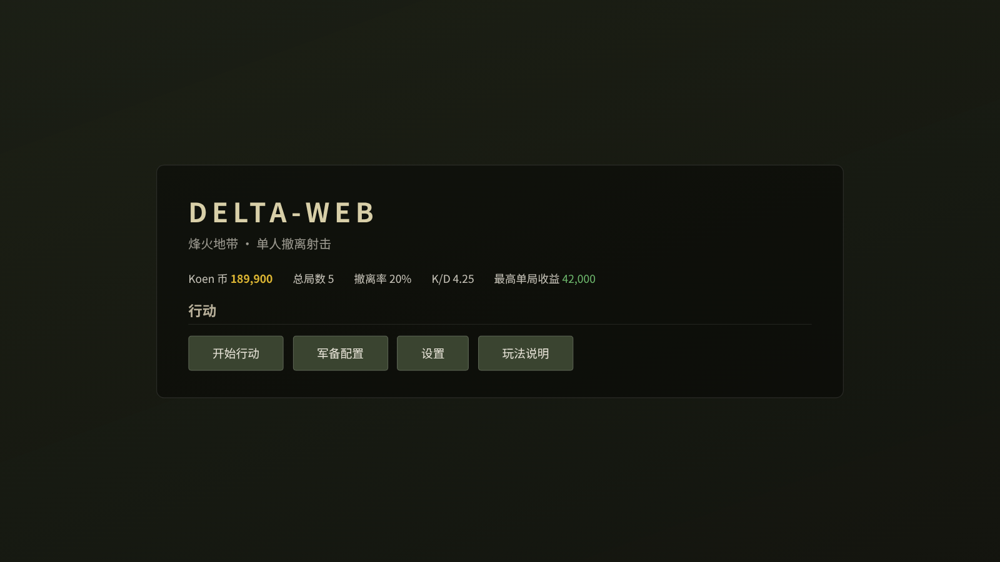
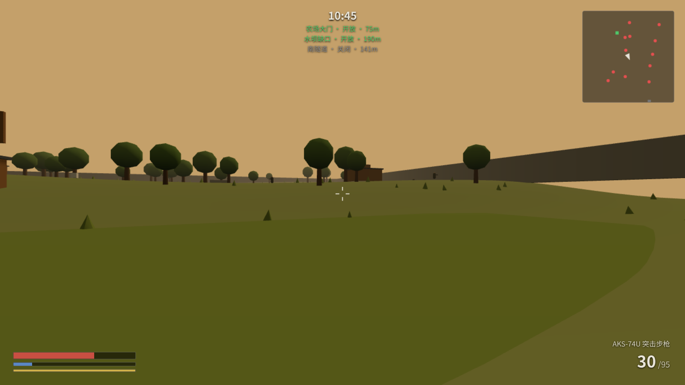

# DELTA-WEB

网页端 3D 第一人称撤离射击游戏，致敬《三角洲行动》烽火地带玩法。

基于 `https://github.com/vimalinx/delta-web` 二次开发，详见文末「来源与致谢」。



## 快速开始

纯静态站点 —— 无构建步骤、无打包、无 npm 运行时依赖。

```bash
git clone https://github.com/376680/df.git
cd df
python3 -m http.server 8931
```

浏览器打开 http://localhost:8931/

需要支持 WebGL2 的现代浏览器（Chrome / Edge / Safari）。未做移动端适配，需要键鼠。

> **改了代码刷新看不到变化？** 硬刷新（Cmd/Ctrl + Shift + R）。ES module 会被浏览器缓存，普通刷新可能拿到旧版本，表现为「改动没生效」甚至新旧模块混载报错。

## 操作

| 按键 | 功能 |
| --- | --- |
| W A S D | 移动 |
| Shift | 冲刺（消耗体力） |
| C | 蹲伏 |
| Space | 跳跃 |
| Ctrl | 缓步（静音） |
| 鼠标左键 | 开火 |
| 鼠标右键 | 瞄准（降低扩散与垂直后坐力；暂无视野变化） |
| 1 / 2 / 3 / 4 | 主武器 / 副武器 / 近战 / 投掷物 |
| R | 换弹 |
| G | 投掷 |
| H | 使用医疗品 |
| E | 搜刮交互 |
| Tab | 背包 |
| M | 战术地图 |
| Esc | 关闭已打开的界面（背包 / 地图 / 搜刮面板） |

## 玩法

跳伞（随机出生点）进入「长弓溪谷」，在 **4 分钟**内搜刮物资、对抗 AI，从 **3 个撤离点**（全部开放）中任选一处撤出。

**撤离带出才算赚** —— 死亡失去背包内一切（安全箱物品保留）。

- **地图** 240 × 240 m：农场区、工业区（集装箱 / 油罐 ×2 / 大仓库）、溪谷（河流 + 双木桥）、防空洞高价值区
- **物资** 26 个固定容器（木箱 / 工具箱 / 医疗箱 / 保险柜 / 弹药箱 5 类），敌人尸体额外可搜；28 种物品定义（6 武器 + 5 弹药 + 2 护甲 + 3 医疗 + 2 投掷 + 10 杂物），白绿蓝紫金五档稀有度；4×4 格子背包
- **经济** 撤离时 Koen = round(背包物资总值 × 1.15) + 击杀奖励（每击杀 +800）；死亡仅结算击杀奖励，背包全失、安全箱物品保留。带出物品进入局外仓库，另有军备配置、安全箱与战绩统计（Koen 目前只累计展示，暂无消费入口）
- **存档** localStorage 持久化，支持 JSON 导入导出

## 特性

**武器** 6 种（AKS-74U / MP5 / M700 栓狙 / M870 霰弹 / M45 手枪 / 战术刀）+ 手雷 / 烟雾弹

| 武器 | 类别 | 弹匣 |
| --- | --- | --- |
| AKS-74U 突击步枪 | 步枪 | 30 |
| MP5 冲锋枪 | 冲锋枪 | 30 |
| M700 栓动狙击 | 狙击 | 5 |
| M870 霰弹枪 | 霰弹 | 5 |
| M45 手枪 | 手枪 | 12 |
| 战术刀 | 近战 | — |
| 手雷 / 烟雾弹 | 投掷 | — |

hitscan 命中判定 + 后坐力 + 距离衰减 + 开镜精度。

**AI** 巡逻 → 警戒 → 交战三态状态机；视锥 / 听声感知（枪声 75 m 传播，手枪 / 霰弹约 50 m）、点射节奏、横移拉扯、换弹窗口。每局 **5–7 人**，每 **300 s** 补员 **2 人**。

**表现** 白天光照（ACES 色调映射 + sRGB 输出）+ 指数雾 + 实时阴影（阴影相机跟随玩家 ±40 m）。全程序化合成音频：枪声 / 脚步 / 爆炸 / 心跳 / 风声，距离衰减 + 声像。

**第一人称武器模型** 5 把枪参数化拼装，机匣 / 枪管 / 弹匣 / 枪托 / 瞄具各不相同；枪口闪光（点光常驻只调 intensity，避免切换灯光可见性触发着色器重编译）；曳光从枪管末端出发、收敛到命中点。

## 技术

- **three.js r180**，vendored 在 `vendor/`，通过 importmap 引入，不依赖 CDN
- **原生 ES module** —— 无构建、无打包
- **渲染** ACES 色调映射 + sRGB 输出色彩空间；方向光阴影（frustum ±40，每帧跟随玩家）；白天基调
- **美术全程序化** —— 所有几何体由代码生成，零贴图、零外部资源
- **地图细节** 130 棵树 + 260 草丛用 InstancedMesh

## 性能

实测环境：进入一局后将渲染分辨率临时设为 1600×900，连续采样 60 帧并缓慢转向扫景（无头 Chromium；采样时原始视口 1058×622）。

- **draw call 16–152**（随镜头方向内容差异很大）
- **三角形 31,606–33,960**（均值约 32,557）
- 渲染循环走 requestAnimationFrame，帧率跟随显示器刷新率（常见 60 FPS 显示器上锁 60）；无头环境 rAF 不受垂直同步限制，其 FPS 数值无参考意义，故不列

## 项目结构

```
index.html
loading.js            GTA V 风格载入遮罩
fps.js                左上角 FPS 计数器
src/
  main.js             App 入口：渲染器 / 相机 / 场景 / 主菜单循环
  config.js           全部可调参数（世界 / 玩家 / AI / 武器 / 物资）
  engine/             Input · SaveManager
  game/               Game.js（对局主控）
  world/              WorldBuilder（地图生成）· CollisionWorld
  player/             Player（移动 / 物理 / 相机）
  combat/             WeaponSystem · Enemy · ViewModel
  loot/               LootSystem · Inventory
  ui/                 HUD · Menus · Overlay
  audio/              AudioEngine
vendor/               three.js r180
```

## 开发状态

**已完成**

- AI 开火前视线（LOS）检查、听觉半径、枪口闪光 / 曳光 / 枪声反馈
- 单局节奏与三撤离点全开
- GTA V 风格载入遮罩（法律声明版式 + 右下角转圈指示器）
- 左上角 FPS 计数器（失焦时显示 `--`，不挂旧数字）
- ACES 色调映射与 sRGB 输出色彩空间
- 方向光阴影：低角度太阳、收紧并跟随玩家的阴影视锥、地面接收阴影
- 白天基调：天空 / 雾 / 光照去暖，太阳仰角约 42°
- 第一人称武器模型（5 把枪参数化拼装）
- 玩家枪口闪光、曳光起点对齐枪管末端

**待做**

- 走动摇摆（bob / sway）
- 开镜位移（ADS 位移 + 启用 `adsFov`，目前是死参数）
- 换弹 / 切枪动画
- 贴墙时枪模穿墙收回
- 移动端适配

## 已知问题

- 搜刮容器时可能抛 `ReferenceError: defId is not defined`（[LootSystem.js](src/loot/LootSystem.js) 的 `weaponGrid()` 内引用了不存在的变量 `defId`：抽到弹药 / 护甲 / 医疗 / 投掷物时触发，重试搜索可能绕过）
- 击倒敌人生成尸体容器时控制台报材质 color 警告（尸体容器没有对应外观配置）
- 贴墙时第一人称枪模会穿墙（未做收回）
- `python3 -m http.server` 下 ES module 缓存不刷新，需硬刷新



## 来源与致谢

本项目的原始版本来自 `https://github.com/vimalinx/delta-web`，我在其基础上做了二次开发。

原项目未附许可证文件。本仓库中的 [LICENSE](./LICENSE)（GPL-3.0）由本人添加，仅适用于本人新增与修改的部分。

本仓库相对原项目的改动：

- AI 开火前增加视线（LOS）检查，修复 `hearRadius` 死配置
- 收紧 AI 开火距离与命中率
- AI 开火增加枪口闪光、曳光与枪声反馈
- 调整单局节奏，三撤离点全开
- 新增 GTA V 风格载入遮罩（法律声明版式 + 右下角转圈指示器）
- 新增 FPS 计数器
- 启用 ACES 色调映射与 sRGB 输出色彩空间
- 方向光阴影与白天基调
- 第一人称武器模型（参数化拼装，5 把枪）

原始版权归原作者所有。
